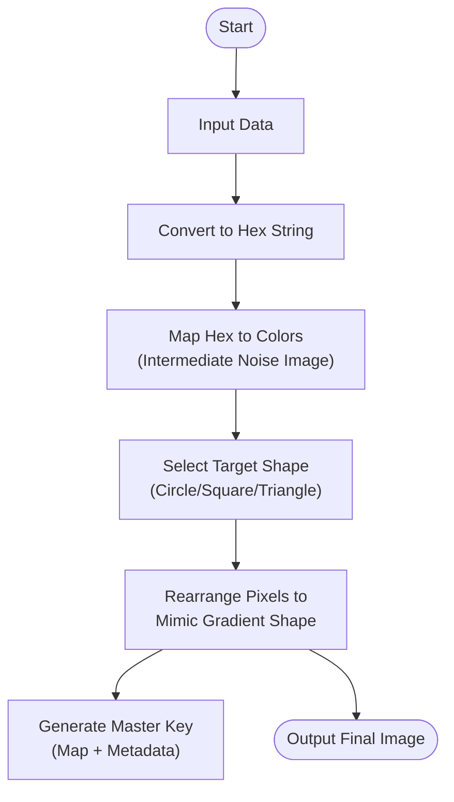
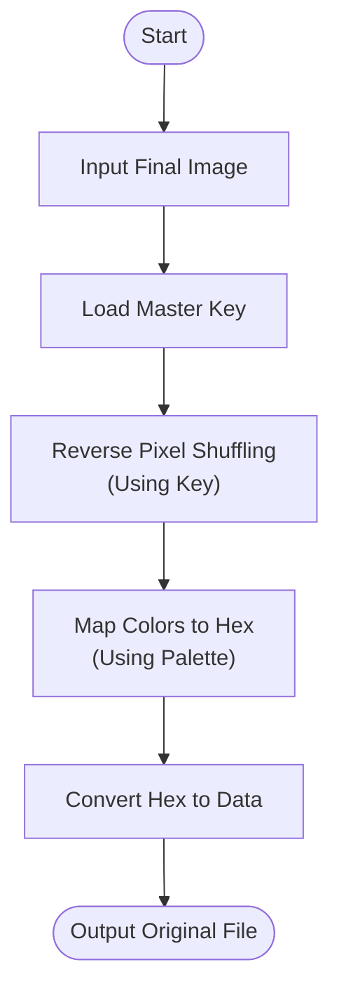

# Visual Encryption System: Proof of Concept

## 1. Executive Summary
This document outlines the architecture and workflow for an advanced **Visual Encryption & Steganography System**. This system transforms raw data into visual patterns (pixels) and then intelligently rearranges these pixels to mimic a target image chosen by the user. The result is an encrypted image that visually resembles a recognizable picture, while the original data is recoverable only via a generated **Master Key**.

## 2. System Architecture

The system uses a two-stage process: **Data-to-Color Conversion** and **Pixel Rearrangement (Mimicry)**. A comprehensive **Master Key** is generated to reverse the process.

### Encryption Flow

### Decryption Flow

## 3. Detailed Components

### 3.1 Input Processing
*   **Input**: Any text string or binary file.
*   **Conversion**: Data is converted to a hexadecimal string representation.

### 3.2 Intermediate Image Generation
*   **Color Mapping**: Hex characters (0-F) are mapped to specific colors using a standard palette.
*   **Result**: An "Intermediate Noise Image" is created, containing the raw encrypted data as colored pixels.

### 3.3 Image Mimicry & Pixel Shuffling
*   **Target Generation**: Instead of a complex user-selected image, the system generates a target pattern based on a rotation.
*   **Pattern Rotation**: The target cycles between three shapes:
    1.  **Gradient Circle**
    2.  **Gradient Square**
    3.  **Gradient Triangle**
*   **Gradient Style**: All shapes feature a radial gradient, starting with light pixels in the center and fading to dark pixels at the exterior.
*   **Rearrangement Algorithm**: The system rearranges the pixels of the "Intermediate Noise Image" to form the selected shape from the rotation.
*   **Output**: A final BMP image that visually represents one of these geometric shapes.

### 3.4 The Master Key
A separate file (e.g., `.key` or `.json`) is generated containing all information required for decryption.

**Key Structure:**
*   **File Metadata**:
    *   `Original Filename`: (e.g., `secret.pdf`)
    *   `File Type`: (e.g., `application/pdf`)
*   **Encryption Data**:
    *   `Shuffle Map`: The coordinate mapping to restore pixels to their original order (e.g., `(x_final, y_final) -> (x_original, y_original)`).
    *   `Color Palette`: The specific Hex-to-RGB mapping used.

## 4. Example Scenario

**Input**: `ABC`
1.  **Hex Conversion**: `41 42 43`
2.  **Intermediate Pixels**: `[Yellow, Red, Yellow, Green, Yellow, Blue]`
3.  **Target Pattern**: The system selects the next shape in rotation (e.g., Gradient Circle).
4.  **Shuffling**: The algorithm moves the pixels to form a circular gradient (light center, dark edges).
    *   *Final Image*: Looks like a pixelated, glowing circle.
5.  **Master Key Generated**: Records that Pixel 1 moved to Pos 5, Pixel 2 to Pos 3, etc., and that the original file was `text.txt`.

## 5. Security Considerations & Limitations
*   **Substitution Cipher**: In its current form, this is a simple substitution cipher. Frequency analysis could potentially break the encryption if the color patterns are analyzed.
*   **Compression**: Lossy compression (like JPEG) will destroy the data. Only lossless formats (BMP, PNG) must be used.
*   **Enhancement**: For true security, the data should be encrypted with AES *before* being converted to hex and mapped to colors.

## 6. Future Improvements
*   Add AES-256 encryption layer before visual mapping.
*   Implement header metadata within the image (e.g., file length) using reserved pixels.
*   Support for shuffling pixel positions based on a seed.
